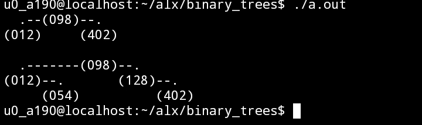

# Binary Trees

```diff
- TASKS:
```

### TASK-#0 New Node | : [0-binary_tree_node.c](0-binary_tree_node.c)

Write a function that creates a binary tree node

* Prototype: binary_tree_t *binary_tree_node(binary_tree_t *parent, int value);
* Where parent is a pointer to the parent node of the node to create
* And value is the value to put in the new node
* When created, a node does not have any child
* Your function must return a pointer to the new node, or NULL on failure

### RESULT:

<sup><sub>RESULT is influenced by [0-main.c](./main_tests/0-main.c) and the [binary_tree_print.c](./binary_tree_print.c)</sub></sup>

***

TASK-#1 Insert left | : [1-binary_tree_insert_left.c)(1-binary_tree_insert_left.c);

Write a function that inserts a node as the left-child of another node

* Prototype: binary_tree_t *binary_tree_insert_left(binary_tree_t *parent, int value);
* Where parent is a pointer to the node to insert theleft-child in
* And value is the value to store in the new node
* Your function must return a pointer to the created node, or NULL on failure or if parent is NULL
* If parent already has a left-child, the new node must take its place, and the old left-child must be set as the left-child of the new node.

### RESULT:

<sup><sub>RESULT is influenced by [1-main.c](./main_tests/1-main.c) and the [binary_tree_print.c](./binary_tree_print.c) and a dependency from the previous task</sub></sup>

***

### TASK-#2 Insert Right | : [2-binary_tree_insert_right.c](2-binary_tree_insert_right.c)

Write a function that inserts a node as the right-child of another node

* Prototype: binary_tree_t *binary_tree_insert_right(binary_tree_t *parent, int value);
* Where parent is a pointer to the node to insert the right-child in
* And value is the value to store in the new node
* Your function must return a pointer to the created node, or NULL on failure or if parent is NULL
* If parent already has a right-child, the new node must take its place, and the old right-child must be set as the right-child of the new node.

### RESULT:

<sup><sub>RESULT is influenced by [2-main.c](./main_tests/2-main.c) and the [binary_tree_print.c](./binary_tree_print.c) and a dependencies from the previous tasks</sub></sup>

***

### TASK-#3 Delete | : [3-binary_tree_delete.c](3-binary_tree_delete.c)

Write a function that deletes an entire binary tree

* Prototype: void binary_tree_delete(binary_tree_t *tree);
* Where tree is a pointer to the root node of the tree to delete
* If tree is NULL, do nothing

### RESULT:

<sup><sub>RESULT is influenced by [3-main.c](./main_tests/3-main.c) and the [binary_tree_print.c](./binary_tree_print.c) and  dependencies from the previous tasks</sub></sup>

***

### TASK-#4 Is leaf | : [4-binary_tree_is_leaf.c](4-binary_tree_is_leaf.c)

Write a function that checks if a node is a leaf

+ Prototype: int binary_tree_is_leaf(const binary_tree_t *node);
+ Where node is a pointer to the node to check
+ Your function must return 1 if node is a leaf, otherwise 0
+ If node is NULL, return 0

### RESULT:

<sup><sub>RESULT is influenced by [4-main.c](./main_tests/4-main.c) and the [binary_tree_print.c](./binary_tree_print.c) and  dependencies from the previous tasks</sub></sup>

***

### TASK-#5 Is root | : [5-binary_tree_is_root.c](5-binary_tree_is_root.c)

Write a function that checks if a given node is a root

* Prototype: int binary_tree_is_root(const binary_tree_t *node);
* Where node is a pointer to the node to check
* Your function must return 1 if node is a root, otherwise 0
* If node is NULL, return 0

### RESULT:

<sup><sub>RESULT is influenced by [5-main.c](./main_tests/5-main.c) and the [binary_tree_print.c](./binary_tree_print.c) and  dependencies from the previous tasks</sub></sup>

***

TASK -#6
Write a function that goes through a binary tree using pre-order traversal

Prototype: void binary_tree_preorder(const binary_tree_t *tree, void (*func)(int));
Where tree is a pointer to the root node of the tree to traverse
And func is a pointer to a function to call for each node. The value in the node must be passed as a parameter to this function.
If tree or func is NULL, do nothing

TASK -#7
Write a function that goes through a binary tree using in-order traversal

Prototype: void binary_tree_inorder(const binary_tree_t *tree, void (*func)(int));
Where tree is a pointer to the root node of the tree to traverse
And func is a pointer to a function to call for each node. The value in the node must be passed as a parameter to this function.
If tree or func is NULL, do nothing

TASK -#8
Write a function that goes through a binary tree using post-order traversal

Prototype: void binary_tree_postorder(const binary_tree_t *tree, void (*func)(int));
Where tree is a pointer to the root node of the tree to traverse
And func is a pointer to a function to call for each node. The value in the node must be passed as a parameter to this function.
If tree or func is NULL, do nothing

TASK -#9
Write a function that measures the height of a binary tree

Prototype: size_t binary_tree_height(const binary_tree_t *tree);
Where tree is a pointer to the root node of the tree to measure the height.
If tree is NULL, your function must return 0

TASK -#10
Write a function that measures the depth of a node in a binary tree

Prototype: size_t binary_tree_depth(const binary_tree_t *tree);
Where tree is a pointer to the node to measure the depth
If tree is NULL, your function must return 0

TASK -#11
Write a function that measures the size of a binary tree

Prototype: size_t binary_tree_size(const binary_tree_t *tree);
Where tree is a pointer to the root node of the tree to measure the size
If tree is NULL, the function must return 0

TASK -#12
Write a function that counts the leaves in a binary tree

Prototype: size_t binary_tree_leaves(const binary_tree_t *tree);
Where tree is a pointer to the root node of the tree to count the number of leaves
If tree is NULL, the function must return 0
A NULL pointer is not a leaf

TASK -#13
Write a function that counts the nodes with at least 1 child in a binary tree

Prototype: size_t binary_tree_nodes(const binary_tree_t *tree);
Where tree is a pointer to the root node of the tree to count the number of nodes
If tree is NULL, the function must return 0
A NULL pointer is not a node

TASK -#14
Write a function that measures the balance factor of a binary tree

Prototype: int binary_tree_balance(const binary_tree_t *tree);
Where tree is a pointer to the root node of the tree to measure the balance factor
If tree is NULL, return 0

TASK -#15
Write a function that checks if a binary tree is full

Prototype: int binary_tree_is_full(const binary_tree_t *tree);
Where tree is a pointer to the root node of the tree to check
If tree is NULL, your function must return 0

### TASK-#16 Is Perfect | : [16-binary_tree_is_perfect.c](16-binary_tree_is_perfect.c)

Write a function that checks if a binary tree is perfect

* NOTE: A tree is perfect if all its leaf nodes are at the same level and all none leaf nodes have two children
* Prototype: int binary_tree_is_perfect(const binary_tree_t *tree);
*Where tree is a pointer to the root node of the tree to check
*If tree is NULL, your function must return 0

### RESULT:

<sup><sub>RESULT is influenced by [16-main.c](./main_tests/16-main.c) and the [binary_tree_print.c](./binary_tree_print.c) modules and dependencies from previous tasks</sub></sup>


TASK -#17
Write a function that finds the sibling of a node

Prototype: binary_tree_t *binary_tree_sibling(binary_tree_t *node);
Where node is a pointer to the node to find the sibling
Your function must return a pointer to the sibling node
If node is NULL or the parent is NULL, return NULL
If node has no sibling, return NULL

TASK -#18
Write a function that finds the uncle of a node

Prototype: binary_tree_t *binary_tree_uncle(binary_tree_t *node);
Where node is a pointer to the node to find the uncle
Your function must return a pointer to the uncle node
If node is NULL, return NULL
If node has no uncle, return NULL

TASK -#19

## RESOURCES:

+ [Binary tree (note the first line: Not to be confused with B-tree.)](https://en.wikipedia.org/wiki/Binary_tree)

+ [Data Structure and Algorithms - Tree](https://www.tutorialspoint.com/data_structures_algorithms/tree_data_structure.htm)

+ [Tree Traversal](https://www.programiz.com/dsa/tree-traversal)

+ [Binary Search Tree](https://en.wikipedia.org/wiki/Binary_search_tree)

+ [Data structures: Binary Tree](https://www.youtube.com/watch?v=H5JubkIy_p8&ab_channel=mycodeschool)
